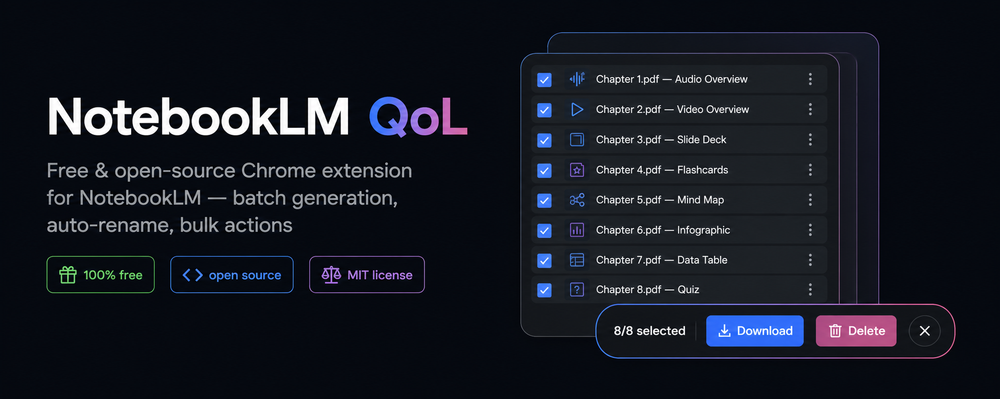
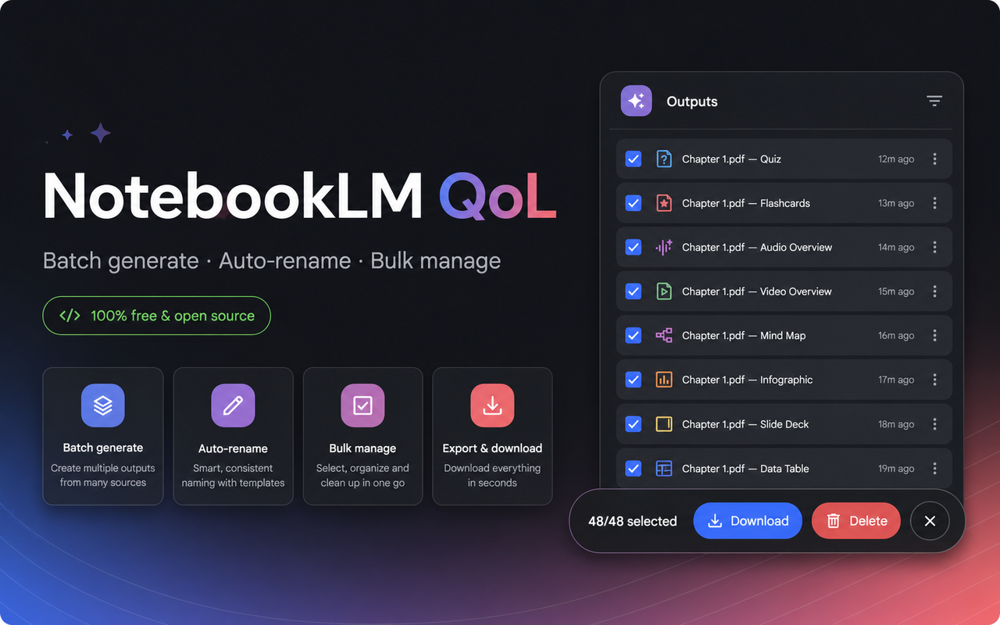

# NotebookLM QoL


A **fully free, open-source** Chrome extension that adds quality-of-life bulk operations to [NotebookLM](https://notebooklm.google.com). It is **not** an importer — it makes managing what's already in your notebooks less painful.

[**Install from the Chrome Web Store**](https://chromewebstore.google.com/detail/notebooklm-qol/fdkgenbncmbhpdhfccnodfnpmmmgfikn)



## Features (v1.3)

- **⚡ Batch generate — one modal, one output per source.** Pick your sources and output type (Audio Overview, Video Overview, Quiz, Report, …), press **Generate batch**, then finish in NotebookLM's **own** options dialog — format tiles, length, language, and even a **custom text prompt** ("what should the hosts focus on", video topic, slide-deck description, …). The extension splits your single request into one generation **per source** at the network level: no dialog replay, no clicking, your options and prompt apply to every source. A bottom-right panel with a **Cancel** button appears while the requests are being sent.
- **Legacy batch mode** — a checkbox in the same modal switches to the older engine that replays NotebookLM's dialog once per source (slower, DOM-driven). Kept as a fallback in case Google changes their internal request format; format-tile choices apply, language/custom prompt don't.
- **Rename by template** — batch results are automatically renamed after their source using a template (`{source} — {type}` by default; variables: `{source}` `{type}` `{date}` `{n}`). Renames are stored persistently and applied by a retry loop as each generation finishes — even if you reload or come back to the tab hours later.
- **Rename by source** — select **existing** outputs (even ones created long before installing the extension) and rename them after the source(s) they were generated from, in one click. Source information is read passively from NotebookLM's own network responses — no dialogs are opened, nothing is clicked.
- **Multi-select Studio outputs** — always-visible checkboxes, a clickable **Select all outputs** header, plus an always-on bulk bar with a live count, one-click bulk **download** and bulk **delete** (single confirmation). Selection is tracked by artifact id, so it survives list reordering and re-renders.
- **Instant bulk download (new in v1.3)** — audio, video, infographics and slide decks are downloaded **directly via the file URLs found in NotebookLM's own responses**: instant, no menu clicking, and the items don't even need to be scrolled into view. Files land auto-renamed in a `NotebookLM/` folder in Downloads. If a direct URL doesn't check out (the extension verifies the server is sending a real file, not an error page), it automatically falls back to clicking NotebookLM's own Download menu. Reports always use the click path; quizzes, flashcards and mind maps have no download in NotebookLM at all and are skipped with a toast.
- **Batch queue panel** — the legacy queue panel (bottom right) shows per-job progress with **Stop after current** / **Resume**, survives reloads, and can be **collapsed** off-screen with the **»** button — a small **« Batch** tab on the screen edge brings it back.
- **Bulk source management** — check sources (NotebookLM's own select-all works fine), then **Delete checked** in one go from the floating bar, or **Find duplicates** (title-based) and remove them keeping the first of each group.

## Privacy

No analytics, no servers, no accounts. The only host permission is `notebooklm.google.com`. All data stays in your browser.

## Install

**Chrome Web Store:** [NotebookLM QoL](https://chromewebstore.google.com/detail/notebooklm-qol/fdkgenbncmbhpdhfccnodfnpmmmgfikn)

**Developer mode:**

1. Download / unzip this folder.
2. Open `chrome://extensions`, enable **Developer mode** (top right).
3. Click **Load unpacked** and select this folder.
4. Open NotebookLM — you'll see checkboxes in the Studio panel and a *⚡ Batch generate…* button under the create buttons.

> After updating the extension, **reload any open NotebookLM tabs** — Chrome invalidates the old content script and buttons would otherwise fail with "Extension context invalidated".

## Development

```bash
bash build.sh                      # bundles src/ -> dist/ with esbuild
npx tsx --test src/lib/*.test.ts   # unit tests (pure logic)
```

Architecture:

- `src/content/selectors.ts` — **every** DOM selector lives here, nothing else touches raw selectors.
- `src/content/adapter.ts` — all NotebookLM actions (list/select/rename/delete/download/generate) via DOM automation.
- `src/content/interceptor.ts` — MAIN-world script (injected at `document_start` by `inject.ts`) that passively parses NotebookLM's own Studio network responses (artifact ids, titles, types, status, **source ids** and **direct download URLs**) and, when armed, splits one user-made generation request into one request per source — custom prompts and options included. Fun fact learned the hard way: NotebookLM uses the **same internal type code for quizzes and flashcards**; the subtype hides deeper in the payload. Communicates with the content script via `CustomEvent`s only; if Google renames the RPC ids it degrades silently and the DOM features keep working.
- `src/content/registry.ts` — content-script side: artifact ↔ sources registry + persistent auto-rename for split-mode batches.
- `src/lib/` — pure, unit-tested logic: rename-template engine, duplicate normalizer, queue state machine.
- `src/content/ui.ts` — injected UI (checkboxes, bulk bars, batch modal, queue panel, batch-cancel panel).
- `src/background.ts` — notifications, download renaming via `downloads.onDeterminingFilename`, and **verified direct downloads**: the background starts the download from the network URL, checks the response is a real file (not an HTML error page) and reports back so the content script can fall back to the click path.

There is no official NotebookLM API; everything works through the DOM plus passive network parsing. If Google changes the UI, fix `selectors.ts` first. Any selector failure disables its feature gracefully — the native page keeps working untouched.

## Known limitations (v1.3)

- **Auto-renames after a batch can lag a little** — they are applied as soon as each generation finishes, piggybacking on NotebookLM's own status polling, so a rename can land a few seconds after the item appears (and self-corrects after a reload).
- **Bulk downloads:** Chrome blocks multiple automatic downloads by default. The first time, click **Allow** on Chrome's "download multiple files" prompt (or allow it under Site settings → Automatic downloads for notebooklm.google.com), otherwise only the first file arrives.
- **Quizzes, flashcards and mind maps have no Download option in NotebookLM at all** — bulk download skips them and says so in a toast. Reports download via the click path (the item must be visible in the Studio list).
- Batch **language** applies reliably to titles and Audio Overviews; Video Overview *content* may still come out in English — that appears to be a NotebookLM-side limitation, not an extension bug.
- Renaming old outputs made from **many** sources names them after the first source plus `+N` (e.g. `Ch02.pdf +6 — Quiz`).
- **Rename by source** needs the artifact data captured since the last page load; if you get a "no source data captured yet" toast, reload the page and let the Studio list load first. Mind Maps aren't covered by the network registry yet and fall back to their current title.
- Duplicate detection is title-based (URL-based matching is implemented and tested in `src/lib/dedupe.ts`, but NotebookLM's source list doesn't expose URLs in the DOM).
- Bulk download triggers individual downloads (auto-renamed) rather than a single ZIP.
- Source-selection persistence and dashboard bulk-delete of notebooks are planned for a future version.

## Changelog

- **1.3.1** — direct downloads are now verified (HTML error pages are detected, cancelled and automatically retried via the click path); README refresh.
- **1.3.0** — instant network-based bulk downloads (audio/video/infographic/slide deck); fixed quizzes being labeled "Flashcards" in renames; Cancel button while a batch is being sent; collapsible queue panel; debug logging off.
- **1.2.x** — unified batch modal (sources + type + options + custom prompt in one flow); fixed a false "batch cancelled" during fan-out; bulk bar no longer covers the last outputs; hardened renames against list re-renders.
- **1.1.0** — network interceptor: custom prompt mode (split one request into per-source generations), rename by source for existing outputs.
- **1.0.x** — initial release: batch generate (legacy engine), rename templates, multi-select bulk download/delete, bulk source management, duplicate finder.
